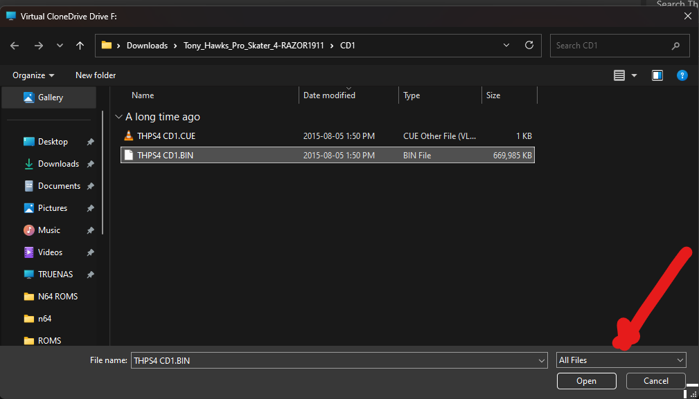
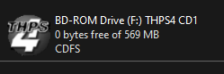
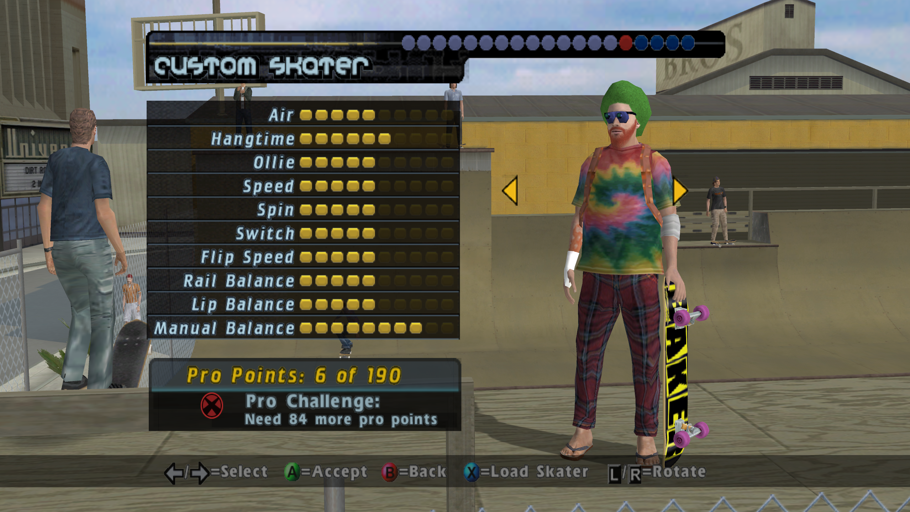

<h1 align="center">
  
</h1>

  <b>THPS4-PC</b> - A guide on getting tony hawk's pro skater 4 running on a modern PC 🛹
   
   
  <a href="https://github.com/jtmb/THPS4-PC/issues/new?assignees=&labels=bug&title=bug%3A+">Report a Bug</a>

 

Table of Contents

- [Prerequisites](#prerequisites)
- [Downloading Tony Hawk's Pro Skater 4](#Downloading-Tony-Hawk's-Pro-Skater-4) 
- [Installing Tony Hawk's Pro Skater 4](#Installing-Tony-Hawk's-Pro-Skater-4)
- [Tony Hawk's Pro Skater 4 NO CD patch](#Tony-Hawk's-Pro-Skater-4-NO-CD)
- [Tony Hawk's Pro Skater 4 Widescreen Support](#Tony-Hawk's-Pro-Skater-4-Widescreen-Support)
- [How to get in-game Xbox controller button prompts instead of keyboard keys](#how-to-get-in-game-xbox-controller-button-prompts-instead-of-keyboard-keys)
- [Contributing](#contributing)
- [License](#license)

 

---  
## Prerequisites
- Windows 7-11
- A functioning brain

### Downloading Tony Hawk's Pro Skater 4

1. Download [THPS4](https://www.myabandonware.com/game/tony-hawk-s-pro-skater-4-cn6#download) along with the serial key and no cd crack. 
  
  

    > **Important:**
    > 
    > During the installation, you will be asked for the `Serial Key`.
    > 
    > The online/LAN portion of the game checks the lobby for clients using **duplicate serial keys** and will not allow you to join if you have the same key as another client in the lobby.
    > 
    > Therefore, if you plan **to play online/LAN**, use the a serial key from the [THPS4 Key generator](http://thps-mods.com/thps4cdkey.php) instead of the one downladed in the [Step1](#Downloading-Tony-Hawk's-Pro-Skater-4).
    >  
 

2. Download and install  [Virtual Clone Drive](https://www.elby.ch/en/products/vcd.html)

### Installing Tony Hawk's Pro Skater 4
1. Once you have installed [Virtual Clone Drive](https://www.elby.ch/en/products/vcd.html) - launch the application and create a new disk using default settings and click ok:

    

    Your disk should now show up in "This PC":

      

2.  Extract the `Tony-Hawks-Pro-Skater-4_Win_EN_ISO-Version.zip` folder:

     

    Right click your virtual disk drive, select `Virtual Clone Drive` and Open `Tony_Hawks_Pro_Skater_4-RAZOR1911\CD1\THPS4 CD1.BIN` located in your downloads folder:

    

    Select the `THPS4 CD1.BIN` file and click `Open` (MAKE SURE TO SET VIEW TO `ALL FILES` if you can't see the .BIN file.)

    

    You should see your virtual disk icon change to THPS4, you can now double click and launch the installer to complete the installation :

     

    > **Important:**
    > 
    > During the installation, you will be asked for the `Serial Key`.
    > 
    > The online/LAN portion of the game checks the lobby for clients using **duplicate serial keys** and will not allow you to join if you have the same key as another client in the lobby.
    > 
    > Therefore, if you plan **to play online/LAN**, use the a serial key from the [THPS4 Key generator](http://thps-mods.com/thps4cdkey.php) instead of the one downladed in the [Step1](#Downloading-Tony-Hawk's-Pro-Skater-4).
    >  
 
     
 

### Tony Hawk's Pro Skater 4 NO CD

1. Extract the contents of `Tony-Hawks-Pro-Skater-4_NoCD_Win_EN.zip`
2. Move the contents of `Game` into your game directory and `start.exe` into your main game install directory:

    (pay attention, there is a start.exe that goes in `\game` and one that goes in the games root directory)

    
    
    
    

 

### Tony Hawk's Pro Skater 4 Widescreen Support

1. Download [ThirteenAG's Widescreen fix](https://thirteenag.github.io/wfp#thps4)

2. Extract the contents of "TonyHawksProSkater4.WidescreenFix.zip" into your game directory.
 
3. Edit the `TonyHawksProSkater4.WidescreenFix.ini` file in `\scripts`, set your desired resolution, save and launch your game.

     

### How to get in-game Xbox controller button prompts instead of keyboard keys

1. Open the `Tony Hawks Pro Skater 4\game-data\fonts folder`. Backup the "ButtonsXboxfnt.DAT" file, by renaming it "ButtonsXboxfnt.dat.old".

    

2. Download this file: https://drive.google.com/file/d/1oP18y6yBkldjK-G-l0vt97jqRiFMp7xc/view?usp=sharing

3. Now copy the new file to the `Tony Hawks Pro Skater 4\game-data\fonts folder` folder. This will now display standard Xbox controller fonts in-game.

    

## Contributing

First off, thanks for taking the time to contribute! Contributions are what makes the open-source community such an amazing place to learn, inspire, and create. Any contributions you make will benefit everybody else and are **greatly appreciated**.

Please try to create bug reports that are:

- _Reproducible._ Include steps to reproduce the problem.
- _Specific._ Include as much detail as possible: which version, what environment, etc.
- _Unique._ Do not duplicate existing opened issues.
- _Scoped to a Single Bug._ One bug per report.

## License

This project is licensed under the **GNU GENERAL PUBLIC LICENSE v3**. Feel free to edit and distribute this template as you like.

See [LICENSE](LICENSE) for more information. 

